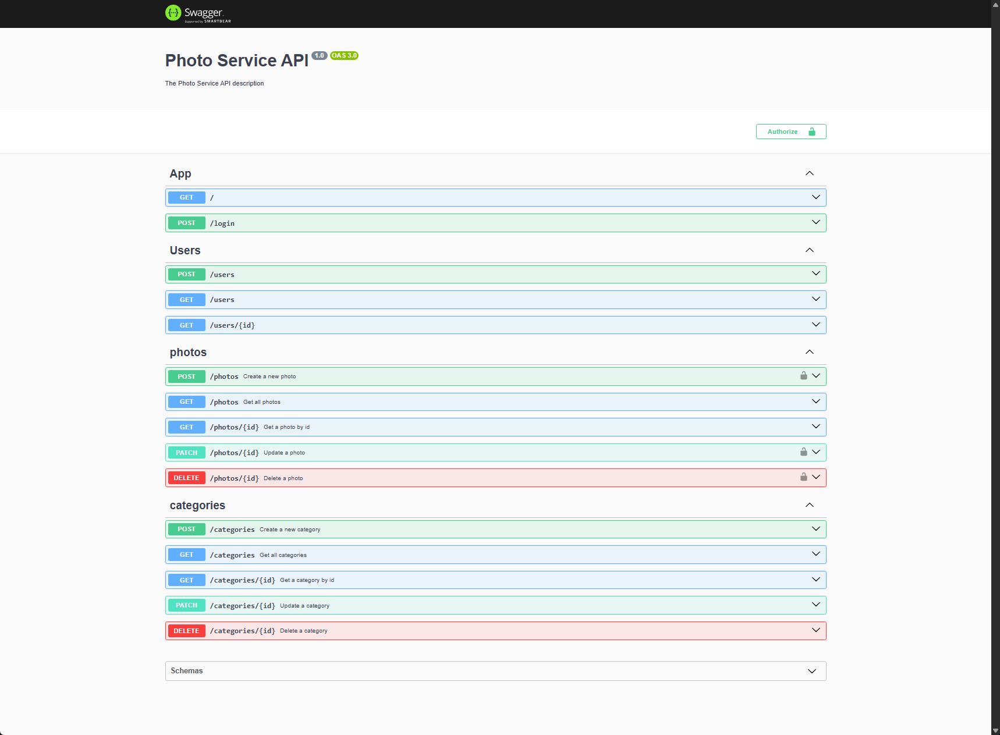
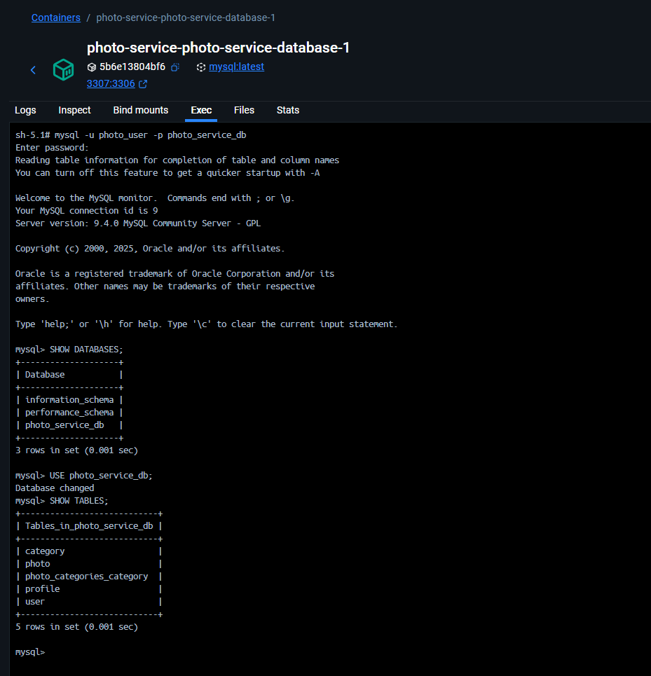
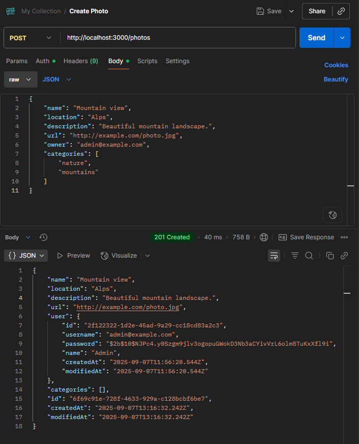

# Photo Service

A REST API for managing users, photos and categories, built with
[NestJS](https://nestjs.com/) and MySQL. Users register and log in, upload
photos with metadata, and tag them by category. Every route except login is
protected by JWT.

## Features

- **Users**: registration, authentication, hashed passwords
- **Profiles**: each user has a profile with gender and photo
- **Photos**: name, location, description and URL, assigned to categories
- **Categories**: unique, managed through the API
- **Auth**: JWT login and route protection
- **Database**: MySQL via TypeORM, with migrations
- **Docker**: `docker-compose.yaml` for local MySQL

## Tech Stack

- **Framework:** NestJS
- **Language:** TypeScript
- **Database:** MySQL, TypeORM
- **Auth:** JWT, hashed passwords
- **Docs:** Swagger / OpenAPI
- **Testing:** Jest (unit and e2e)
- **Containers:** Docker Compose

## API Overview

| Endpoint | Methods | Notes |
|---|---|---|
| `/login` | POST | Returns a JWT |
| `/users` | CRUD | |
| `/photos` | CRUD | Photos can be assigned categories |
| `/categories` | CRUD | |

All endpoints except `/login` and `/` require a JWT.

Interactive documentation is available at `http://localhost:3000/api` once
the app is running. The **Authorize** button accepts a JWT for testing
protected routes.



## Getting Started

**Prerequisites:** Node.js 18+, npm, Docker

```bash
npm install
```

**Environment variables.** Create a `.env` file:

```
DB_HOST=localhost
DB_HOST_PORT=3306
DB_USER=photo_user
DB_PASSWORD=password
DB_ROOT_PASSWORD=rootpassword
DB_DATABASE=photo_service_db

JWT_SECRET=your_jwt_secret
JWT_EXPIRES_IN=3600s
```

> **Security note:** change every default password and secret before
> deploying or sharing. Keep `.env` out of version control by adding it to
> `.gitignore`.

**Start MySQL:**

```bash
docker compose up --force-recreate --build photo-service-database -d
```

**Run the app:**

```bash
npm run start        # development
npm run start:dev    # watch mode
npm run start:prod   # production
```

**Run tests:**

```bash
npm run test         # unit
npm run test:e2e     # e2e
npm run test:cov     # coverage
```

<details>
<summary>Working with the MySQL container directly</summary>

1. Open Docker Desktop, go to **Containers**, and select the running MySQL container.
2. Click the **Exec** tab to open a shell inside it.
3. Log in with the credentials from `.env`:

```sh
mysql -u photo_user -p photo_service_db
```

Or as root:

```sh
mysql -u root -p
```

Once connected:

```sql
SHOW DATABASES;
USE photo_service_db;
SHOW TABLES;
DESCRIBE users;
```



</details>

<details>
<summary>Testing endpoints with Postman</summary>

**1. Log in to get a token.** POST to `http://localhost:3000/login`, body as
raw JSON:

```json
{
  "username": "your@email.com",
  "password": "yourpassword"
}
```

The response contains an `access_token`.

**2. Authorize.** For protected endpoints, add a header:

```
Authorization: Bearer <your_token_here>
```

**3. Create a photo.** POST to `http://localhost:3000/photos` with the
Authorization header set:

```json
{
  "name": "Mountain view",
  "location": "Alps",
  "description": "Beautiful mountain landscape.",
  "url": "http://example.com/photo.jpg",
  "owner": "admin@example.com",
  "categories": ["nature", "mountains"]
}
```



</details>

## Resources

- [NestJS docs](https://docs.nestjs.com) and [deployment guide](https://docs.nestjs.com/deployment)
- [TypeORM docs](https://typeorm.io)
- [Docker Compose](https://docs.docker.com/compose/)

## License

MIT
